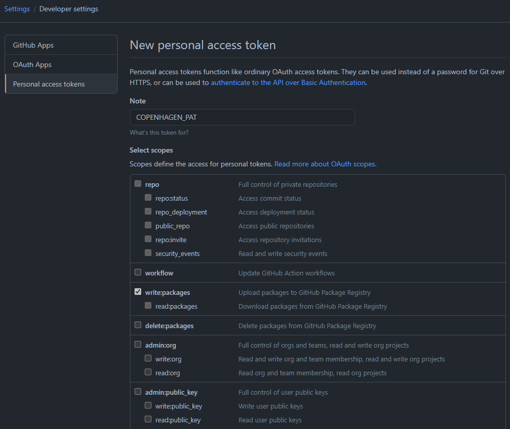
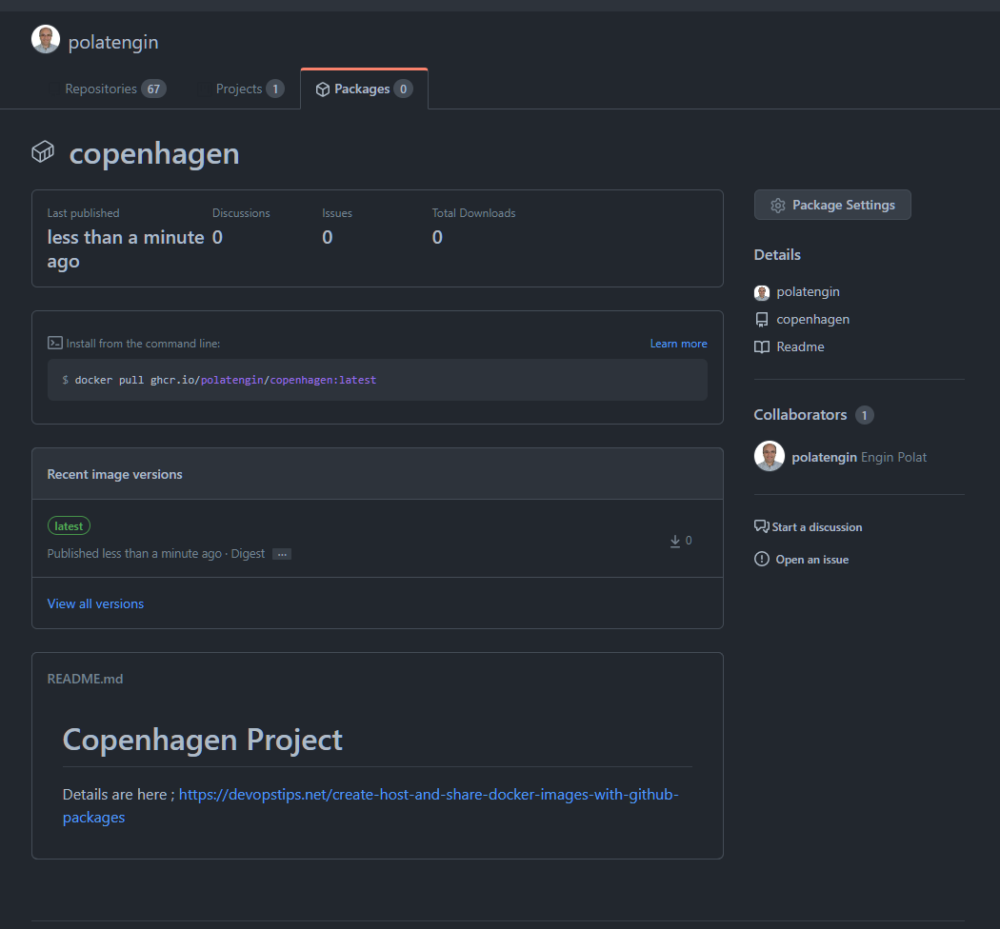

After the rise of _cloud_, and rise of _microservices approaches_, _modular_, _plug-and-play_ and _containerized_ applications are getting more attention.

So, literally _hundreds of thousands_ software engineers are working on projects that built with multiple _containerized_ pieces, all around the world.

If you're using [GitHub](https://github.com) and wanted a place to store and serve _Docker Images_ for your project, you can easily go and use [GitHub Packages](https://github.com/features/packages), it's free <sup>(*)</sup> and super easy to use 🥳

You can have package registries for your;

- Docker Images
- npm packages
- Maven packages
- Gradle packages
- NuGet packages
- Ruby Gems

_<sup>(*)</sup>: Actually, it's not free (🤦‍♂️) if you want to store more than 500MBs_

|Plan|Storage|
|:---|---:|
|Free|500 MB|
|Pro|2 GB|
|Team|2 GB|
|Enterprise|50 GB|
|Additional Storage|$0.25 per GB|

In this post you can find a guideline to publish, serve and pull a Docker Image to GitHub Packages.

## Creating the repo and Dockerfile

Let's create a repo on [GitHub](https://github.com) first;


After creating the repo, _clone_ it and open it with your favorite editor (mine is [Visual Studio Code](https://code.visualstudio.com) 😎)

```bash
git clone https://github.com/polatengin/copenhagen.git

code copenhagen/
```

Now we need to create a _Dockerfile_ and build the image we need in the project. (_Example Dockerfile can be found on [Copenhagen](https://github.com/polatengin/copenhagen) repo, [Dockerfile](https://github.com/polatengin/copenhagen/blob/master/Dockerfile)_)

```dockerfile
FROM ubuntu:latest

LABEL org.opencontainers.image.source=https://github.com/polatengin/copenhagen
```

<br />

## Logging in to GitHub Container Registry (a.k.a. GitHub Packages)

Navigate to [Personal Access Tokens](https://github.com/settings/tokens) under [GitHub Account Settings](https://github.com/settings/profile), and create a new one, just like below;



_* Don't forget to set write:packages permission_

It'll display the _PAT_, copy it to the clipboard.

Run the following command to login via [docker cli](https://docs.docker.com/engine/reference/commandline/login/);

```bash
echo ${GITHUB_PAT} | docker login ghcr.io -u ${GITHUB_USERNAME} --password-stdin
```

_* Don't forget to set your username and PAT to the GITHUB&#95;USERNAME and GITHUB&#95;PAT variables_

## Building and Pushing Docker Image to GitHub Container Registry (a.k.a. GitHub Packages)

It's time to [build](https://docs.docker.com/engine/reference/commandline/build/), [tag](https://docs.docker.com/engine/reference/commandline/tag/) and [push](https://docs.docker.com/engine/reference/commandline/push/) the _Docker Image_ to the _GitHub Container Registry_ (_a.k.a. GitHub Packages_);

```bash
docker build -t copenhagen .

docker tag copenhagen ghcr.io/polatengin/copenhagen:latest

docker push ghcr.io/polatengin/copenhagen:latest
```

After the Docker Image has been pushed, we can consume it in our projects;

<video controls style="width:100%">
  <source src="../_static/assets/2021/03/github-packages-2.mp4" type="video/mp4" />
</video>

We can see the packages in out GitHub Account, by navigating to the Packages tab (like, [https://github.com/polatengin?tab=packages](https://github.com/polatengin?tab=packages))



## Using images from GitHub Container Registry (a.k.a. GitHub Packages)

After login to _GitHub Container Registry_, we can easily pull and consume images;

```bash
echo ${GITHUB_PAT} | docker login ghcr.io -u ${GITHUB_USERNAME} --password-stdin

docker run -d -it ghcr.io/polatengin/copenhagen:latest
```

_* Don't forget to set your username and PAT to the GITHUB&#95;USERNAME and GITHUB&#95;PAT variables_

So, it's possible (_and relatively easy_) to use _GitHub Packages_, within your _CI/CD_ orchestration platform (_such as [GitHub Actions](https://github.com/features/actions)_), or _Kubernetes_ platform (_such as, [Azure Kubernetes Service (AKS)](https://docs.microsoft.com/en-us/azure/aks/)_)

## References

- [Official GitHub Packages documentation](https://docs.github.com/en/packages/learn-github-packages/about-github-packages)
- [Docker CLI Login command documentation](https://docs.docker.com/engine/reference/commandline/login/)
